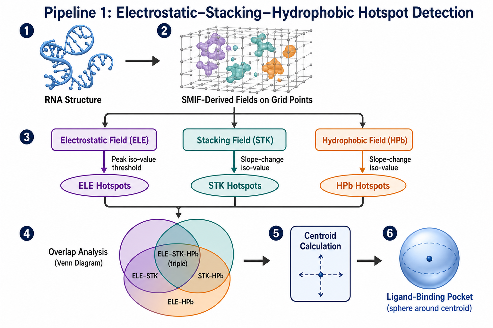
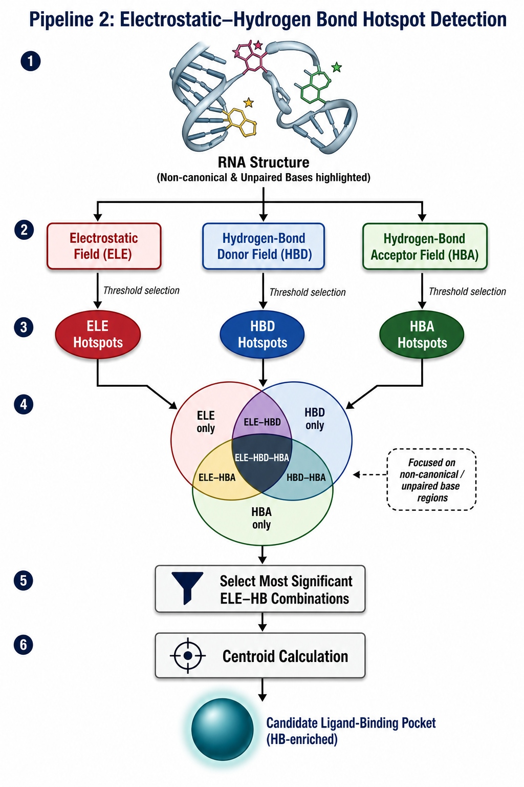
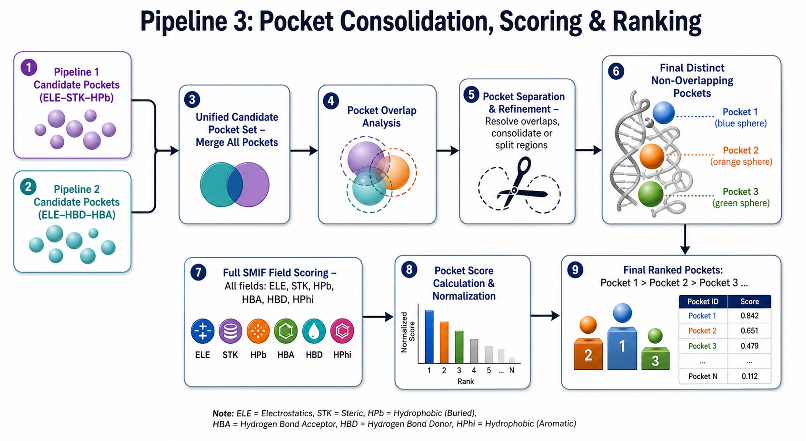

# SPockeR

SPockeR is a SMIFs-based (Statistical Molecular Interaction Fields) pipeline for
detecting, volumetrically defining, and scoring ligand-binding pockets in
RNA 3D structures. It combines electrostatic (APBS), hydrophobic, base
stacking, and hydrogen-bond donor/acceptor fields to identify unique
druggable pockets, ranked by a physics-based composite score.

## Pipeline overview

**Pipeline 1 — Binding-Site Hotspot Detection**

**Pipeline 2 — Hydrogen-Bond Hotspot Detection**

**Pipeline 3 — Pocket Consolidation & Scoring**

## System requirements
- OS: Linux x86-64 (tested on Ubuntu 22.04)
- Python 3.9+
- No GPU required

## Installation
git clone https://github.com/rjdebsarkar/SPockeR.git
cd SPockeR
conda env create -f environment.yml
conda activate spocker

## Usage (single PDB, e.g. 1AJU)
See `Command_lines_step_by_step_SPockeR.txt` in this repo for the full
10-step command sequence, or run directly from `scripts/`:

    cd scripts
    ./0_fix_pdb.sh ../data/example/1AJU.pdb 1AJU_fixed.pdb
    ./Pipeline1_Fields_Generation.sh 1AJU_fixed.pdb
    ./Pipeline2_Fields_Generation.sh 1AJU_fixed.pdb
    python Script1_Pipeline1_Slope_Derived_Fixed_Iso_Values_for_Hotspot.py --input_dir Fields_Pipeline1_1AJU_fixed --pdb_id 1AJU_fixed
    python Script2_Pipeline1_Detection_of_Binding_Site_Hotspots.py --fields_dir Fields_Pipeline1_1AJU_fixed --pdb_file 1AJU_fixed.pdb --analysis_dir Analysis_Pipeline1_1AJU_fixed
    python Script3_Pipeline1_Making_Pocket_Volume_Using_Hotspots.py --pdb_file 1AJU_fixed.pdb --analysis_dir Analysis_Pipeline1_1AJU_fixed
    python Script4_Pipeline2_Hydrogen_Bond_Pocket_Hotspots_Using_HBA_HBD_ELE_Fields.py --fields_dir Fields_Pipeline2_1AJU_fixed --analysis_dir Analysis_Pipeline2_1AJU_fixed
    python Script5_Pipeline2_Making_Hydrogen_Bond_Pocket_Volume.py --pdb_file 1AJU_fixed.pdb --analysis_dir Analysis_Pipeline2_1AJU_fixed
    python Script6_Trimming_APBS_for_Scoring_Unique_Pockets.py --fields_dir Fields_Pipeline1_1AJU_fixed --pdb_file 1AJU_fixed.pdb --cutoff 5.0
    python Script7_Trimming_Hydrophobic_for_Scoring_Unique_Pockets.py --fields_dir Fields_Pipeline1_1AJU_fixed --pdb_id 1AJU_fixed
    python Script8_Making_Unique_Pockets_Using_All_Previous_Pockets.py --analysis1_dir Analysis_Pipeline1_1AJU_fixed --analysis2_dir Analysis_Pipeline2_1AJU_fixed --fields_dir Fields_Pipeline1_1AJU_fixed --pdb_file 1AJU_fixed.pdb

## Output
Final ranked pockets are saved in `Analysis_Unique_Pockets_<pdb_id>/`:
- `<pdb>.Pocket1_Volume.mrc`, `<pdb>.Pocket2_Volume.mrc`, ... (Pocket1 = highest scoring)
- `<pdb>_field_contributions.csv`
- `<pdb>_field_contributions.png`

## Repository structure
    SPockeR/
    ├── scripts/
    │   ├── 0_fix_pdb.sh
    │   ├── Pipeline1_Fields_Generation.sh
    │   ├── Pipeline2_Fields_Generation.sh
    │   ├── Script1_Pipeline1_Slope_Derived_Fixed_Iso_Values_for_Hotspot.py
    │   ├── Script2_Pipeline1_Detection_of_Binding_Site_Hotspots.py
    │   ├── Script3_Pipeline1_Making_Pocket_Volume_Using_Hotspots.py
    │   ├── Script4_Pipeline2_Hydrogen_Bond_Pocket_Hotspots_Using_HBA_HBD_ELE_Fields.py
    │   ├── Script5_Pipeline2_Making_Hydrogen_Bond_Pocket_Volume.py
    │   ├── Script6_Trimming_APBS_for_Scoring_Unique_Pockets.py
    │   ├── Script7_Trimming_Hydrophobic_for_Scoring_Unique_Pockets.py
    │   ├── Script8_Making_Unique_Pockets_Using_All_Previous_Pockets.py
    │   └── indices_rna_hb_available_modified.py
    ├── data/example/          # example PDB (1AJU) for quick testing
    ├── docs/                  # pipeline diagrams and example output figures
    ├── environment.yml        # conda environment specification
    ├── Command_lines_step_by_step_SPockeR.txt
    ├── LICENSE
    └── README.md

## License
See LICENSE file.

## Contact
For questions or issues, please open an issue on GitHub or contact
Raju Sarkar (rjdebsarkar@gmail.com).

## Acknowledgments
We thank the developers of the following open-source tools that SPockeR
relies on:
- volgrids 
- APBS (electrostatics)
- pdbfixer, pdb-tools (structure preparation)
- molutils / RNApolis (RNA annotation)

## Citation
If you use SPockeR in your research, please cite:

    @article{2026spocker,
      author  = {Raju and ...},
      title   = {SPockeR: A SMIFs-based pipeline for RNA ligand-binding pocket detection},
      journal = {TBD},
      year    = {2026}
    }
